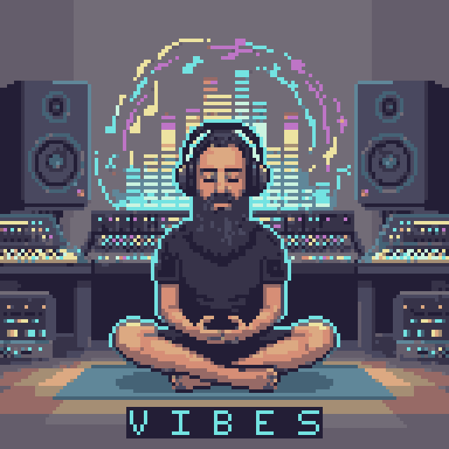

# VIBES - Vaporwave Inspired Bitmap Engine Stack

<div align="center">
  
</div>

## О проекте

**VIBES** — это стартовый шаблон (template) для создания кросс-платформенных игр. В его основе лежит стек технологий, ориентированный на производительность, модульность и чёткое разделение логики.

Проект использует трёхслойную архитектуру:
- **View Layer**: Рендеринг (PixiJS) и UI (Svelte 5).
- **State & Logic Layer**: Управление состоянием (Nanostores) и игровая логика (GameObject-Component).
- **Platform Layer**: Нативные возможности (Capacitor).

## Философия

- **Композиция через компоненты**: `GameObject` собираются из независимых компонентов, которые содержат данные и, иногда, логику.
- **Stores — единственный мост**: Никаких прямых вызовов между PixiJS и Svelte. Всё взаимодействие происходит через Nanostores.
- **Конфигурируемость**: Весь игровой баланс вынесен в `src/stores/game/Config.ts`.
- **Малые модули**: Проект состоит из небольших, сфокусированных компонентов, систем и сторов.
- **Два режима**: Игра и редактор сцен.

## Технологический стек

- **Рендеринг**: [PixiJS 8.13.2](https://pixijs.com/)
- **Интерфейс**: [Svelte 5](https://svelte.dev/)
- **Управление состоянием**: [Nanostores](https://github.com/nanostores/nanostores)
- **Стилизация**: [Tailwind CSS 4](https://tailwindcss.com/)
- **Анимации**: [Motion One](https://motion.dev/)
- **Архитектура**: Компонентно-ориентированная (Component-based)
- **Среда выполнения**: [Bun](https://bun.sh/)
- **Мобильная платформа**: [Capacitor](https://capacitorjs.com/)

## Структура проекта

```
.
├── docs/                 # Документация
│   └── architecture.md   # Детальное описание архитектуры
├── src/
│   ├── engine/           # Игровой движок (ядро)
│   ├── game/             # Игровая логика (компоненты, системы)
│   ├── stores/           # Nanostores (состояние игры и UI)
│   ├── ui/               # Svelte-компоненты интерфейса
│   ├── scene-editor/     # Редактор сцен
│   └── main.ts           # Точка входа в приложение
└── AGENTS.md             # Правила для AI-ассистентов
```

## Быстрый старт

1.  **Клонируйте репозиторий:**
    ```bash
    git clone https://github.com/jenissimo/vibes-template
    ```

2.  **Установите зависимости:**
    ```bash
    bun install
    ```

3.  **Запустите dev-сервер:**
    ```bash
    bun run dev
    ```

## Доступные скрипты

- `bun run dev`: запуск в режиме разработки.
- `bun run build`: сборка проекта для продакшена.
- `bun run check`: проверка типов TypeScript.
- `bun run tsc --noEmit path/to/file.ts`: проверка типов для конкретного файла.

### Мобильная разработка

- `bun run cap:sync`: синхронизация с Capacitor.
- `bun run cap:run`: запуск на мобильном устройстве.

## Архитектура

Ключевой принцип архитектуры — строгое разделение ответственности между слоями.

1.  **View Layer (PixiJS & Svelte)**: Отвечает исключительно за отображение. UI-компоненты подписываются на изменения в сторах и рендерят актуальные данные. Игровой мир рендерится через PixiJS.
2.  **State & Logic Layer**: Сердце приложения.
    - **GameObject-Component**: Игровые объекты (`GameObject`) состоят из компонентов, которые содержат данные и логику. Системы используются для глобальных процессов, затрагивающих множество объектов.
    - **Nanostores**: Хранят глобальное состояние (профиль игрока, настройки UI) и служат мостом для взаимодействия между UI и игровой логикой.
3.  **Platform Layer (Capacitor)**: Обеспечивает доступ к нативным API для мобильных устройств.

Подробное описание архитектуры можно найти в файле [`docs/architecture.md`](./docs/architecture.md).